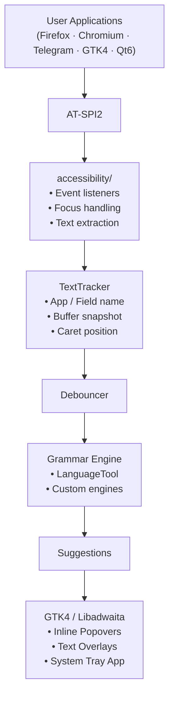

# Contributing to Parmer

Thanks for your interest in contributing to **Parmer**! 🐧

Parmer is an open-source, system-wide grammar checker for Linux. Our mission is to deliver a smooth, native, Grammarly-like experience across your entire desktop—without relying on browser-specific extensions or one-off application plugins.

The project is in an active, early development stage. Our core proof of concept is already functional: Parmer leverages **AT-SPI2** to observe text changes and caret movement across arbitrary desktop applications, reading active text, cursor positions, field names, and application identifiers.

---

## Quick Start

If you're a returning contributor or just want to jump straight in, here is the essential workflow:

```text
Fork & Clone  ──>  Run Prototype  ──>  Create Branch  ──>  Implement & Test  ──>  Open PR
```

### 30-Second Quick Test

Verify that AT-SPI2 event tracking works on your system:

```bash
/usr/bin/python3 -m accessibility.atspi
```

> [!TIP]
> Use your system's Python interpreter (`/usr/bin/python3`) rather than isolated environments like Linuxbrew or pyenv to ensure the `PyGObject` system bindings are available.

### Quick Contribution Checklist

- [ ] **Pick a task**: Check [Immediate Priorities](#immediate-priorities) or browse open issues.
- [ ] **Open an issue**: For new features or architectural changes, discuss them first in an issue.
- [ ] **Branch**: Create a descriptive feature branch (`feat/my-feature` or `fix/issue-description`).
- [ ] **Respect architecture**: Keep `accessibility/`, `core/`, `engines/`, and `ui/` strictly separated.
- [ ] **Privacy first**: Never transmit user text over the network without explicit, opt-in consent.
- [ ] **Commit cleanly**: Use concise, conventional commit messages (`feat:`, `fix:`, `test:`).
- [ ] **Test & submit**: Verify your changes manually or via unit tests and submit a PR answering the [required PR questions](#pull-request-process).

---

## Table of Contents

- [Quick Start](#quick-start)
- [1. Project Overview and Architecture](#1-project-overview-and-architecture)
  - [What Is Parmer?](#what-is-parmer)
  - [Status at a Glance](#status-at-a-glance)
  - [Current Progress](#current-progress)
  - [Current TextTracker](#current-texttracker)
  - [Goals and Non-Goals](#goals-and-non-goals)
  - [System Architecture](#system-architecture)
  - [Repository Structure](#repository-structure)
  - [Planned Grammar Pipeline](#planned-grammar-pipeline)
- [2. Prerequisites and Development Setup](#2-prerequisites-and-development-setup)
  - [System Requirements](#system-requirements)
  - [Python Environment and Binding Caveats](#python-environment-and-binding-caveats)
  - [Running the AT-SPI Prototype](#running-the-at-spi-prototype)
- [3. How to Contribute](#3-how-to-contribute)
  - [Finding Work to Do](#finding-work-to-do)
    - [Immediate Priorities](#immediate-priorities)
    - [By Experience Level](#by-experience-level)
    - [Contribution Domains](#contribution-domains)
  - [Reporting Issues and Proposing Features](#reporting-issues-and-proposing-features)
  - [Branching and Git Workflow](#branching-and-git-workflow)
  - [Git Commit Standards](#git-commit-standards)
  - [Pull Request Process](#pull-request-process)
  - [Submission Checklist](#submission-checklist)
- [4. Code Style and Technical Standards](#4-code-style-and-technical-standards)
  - [Architectural Separation and Boundaries](#architectural-separation-and-boundaries)
  - [Critical AT-SPI2 Implementation Rules](#critical-at-spi2-implementation-rules)
  - [Object Lifetime and Error Recovery](#object-lifetime-and-error-recovery)
  - [Input Handling Policy](#input-handling-policy)
  - [Dependencies and Abstraction Philosophy](#dependencies-and-abstraction-philosophy)
- [5. Testing Guidelines](#5-testing-guidelines)
  - [Testing Scope](#testing-scope)
  - [Desktop and Application Compatibility Testing](#desktop-and-application-compatibility-testing)
  - [Performance and Edge Cases](#performance-and-edge-cases)
- [6. Review Process](#6-review-process)
  - [Review Criteria](#review-criteria)
  - [UI Changes](#ui-changes)
- [7. Roadmap and Milestones](#7-roadmap-and-milestones)
  - [Development Roadmap (Phases 0–12)](#development-roadmap-phases-012)
  - [Milestone Sequence (M0–M10)](#milestone-sequence-m0m10)
- [8. Release and Packaging](#8-release-and-packaging)
- [9. Privacy, Security, and Ethics](#9-privacy-security-and-ethics)
  - [Privacy-First Core Principle](#privacy-first-core-principle)
  - [Sensitive Input Handling](#sensitive-input-handling)
  - [Remote and AI Engine Policy](#remote-and-ai-engine-policy)
  - [Community Standards](#community-standards)
- [10. Troubleshooting, Known Issues, and FAQ](#10-troubleshooting-known-issues-and-faq)
  - [Common Issues and Workarounds](#common-issues-and-workarounds)
  - [Open Research Questions](#open-research-questions)
- [11. Future Ideas (Exploratory)](#11-future-ideas-exploratory)
  - [Persian Grammar Checking](#persian-grammar-checking)
  - [Optional AI Engine](#optional-ai-engine)
  - [Per-Application Configuration](#per-application-configuration)
  - [Custom Dictionaries](#custom-dictionaries)
  - [Writing Style Analysis](#writing-style-analysis)
- [12. Final Note](#12-final-note)

---

## 1. Project Overview and Architecture

### What Is Parmer?

Parmer is designed as a **system-wide grammar checker for Linux**.

Instead of writing custom browser plugins or application-specific integrations for Firefox, Chromium, Telegram, Discord, LibreOffice, GTK apps, or Qt apps, Parmer leverages the Linux accessibility stack. Any application that exposes its text controls through **AT-SPI2** is automatically supported.

The intended user interaction flow:

```text
User types:
"I has a apple"
       │
       ▼
Parmer observes text via AT-SPI2
       │
       ▼
Grammar engine detects:
• "I has"   ──> "I have"
• "a apple" ──> "an apple"
       │
       ▼
Parmer displays an inline suggestion popover
       │
       ▼
User accepts or ignores suggestions
```

Parmer runs as a native Linux desktop utility, respecting your system theme, desktop environment, and privacy.

---

### Status at a Glance

> **Current Stage: Working AT-SPI2 text-tracking proof of concept (PoC)**
>
> Parmer is **not yet a finished grammar checker**. We have proven system-wide text observation and caret tracking. We are currently building a debounced processing pipeline to connect those events to a local grammar engine.

| Component / Subsystem | Status | Details |
| :--- | :--- | :--- |
| **Python project structure** | 🟢 Started | Base directory layout and modules initialized. |
| **AT-SPI2 integration** | 🟢 Working PoC | Functional event loop listening to system accessibility bus. |
| **Focus event handling** | 🟢 Prototype | Receives focus signals; filters out non-text UI components. |
| **Text-change events** | 🟢 Working | Receives and parses `object:text-changed:insert` events. |
| **Caret tracking** | 🟢 Working | Receives and parses `object:text-caret-moved` offset changes. |
| **Reading accessible text** | 🟢 Working | Successfully extracts active buffer text using `Atspi.Text`. |
| **TextTracker state manager** | 🟢 Prototype | Holds active application name, field, text, and cursor index. |
| **Event debouncing** | 🔴 Not implemented | Pending: prevents checking text on every keystroke. |
| **Grammar engine abstraction** | 🟡 Skeleton / Planned | Generic engine interface planned in `core/checker.py`. |
| **Local LanguageTool engine** | 🟡 Skeleton / Planned | Integration wrapper planned in `engines/languagetool.py`. |
| **Suggestion model** | 🟡 Skeleton / Planned | Standard data structure for replacements and ranges. |
| **Suggestion UI** | 🔴 Not implemented | Inline popovers and suggestion widgets pending. |
| **GTK4 / Libadwaita UI** | 🔴 Not implemented | Native desktop controls and system tray pending. |
| **Packaging (Flatpak/Deb)** | 🔴 Not implemented | Distribution packages not yet configured. |
| **Settings & preferences** | 🔴 Not implemented | Configuration storage and UI pending. |
| **Persian grammar checking** | 🔴 Not implemented | Future planned language-specific engine. |
| **Automated test suite** | 🔴 Not implemented | Unit and integration test coverage pending. |
| **Production reliability** | 🔴 Not ready | Early prototype; not yet ready for daily driver use. |

---

### Current Progress

Our prototype validates five key integration capabilities:

1. **AT-SPI Application Discovery**:
   - Confirmed discovery across diverse applications, including Chromium, Telegram, Telegram Desktop, GitHub Desktop, and native GNOME utilities.
2. **Focus Event Filtering**:
   - Focus events fire for arbitrary accessibility widgets (`window`, `panel`, `filler`, `text`). The accessibility layer filters out non-text objects to track only editable, relevant text fields.
3. **Text-Change Events**:
   - Accurately captures insertion events:
     ```text
     Event type : object:text-changed:insert
     Source     : Caption
     Role       : text
     Cursor     : 6
     ```
4. **Caret Movement Events**:
   - Captures `object:text-caret-moved` signals, enabling suggestion placement directly at the user's cursor.
5. **Reading Accessible Text Buffer**:
   - Successfully extracts text buffers across applications.
   - ⚠️ **Key PyGObject Nuance**: Direct method calls like `obj.get_text()` fail because PyGObject resolves to `Atspi.Accessible.get_text(self) -> Atspi.Text` rather than `Atspi.Text.get_text(self, start, end) -> str`.
   - See [Critical AT-SPI2 Implementation Rules](#critical-at-spi2-implementation-rules) for the exact code pattern required.

---

### Current TextTracker

The text-tracking prototype maintains the active field's state using a lightweight `TextTracker` object:

```python
class TextTracker:
    def __init__(self):
        self.application = None
        self.field = None
        self.text = ""
        self.cursor = 0
```

When an accessible object updates, `TextTracker` captures:
- **Application name**: Identifies the source window or process.
- **Field name / accessible role**: Identifies the specific input element.
- **Cursor position**: Current caret integer offset.
- **Text buffer**: Snapshot of the current text string.

---

### Goals and Non-Goals

#### Primary Goals

1. **System-wide coverage**: Provide grammar checking across all accessible Linux desktop applications.
2. **Broad application support**: Work out of the box with GTK, Qt, Electron, Chromium, and Firefox apps.
3. **Native accessibility APIs**: Use Linux-standard AT-SPI2 rather than invasive global keyboard hooks.
4. **Wayland-first design**: Build natively for modern Wayland compositors (as well as X11).
5. **Privacy by default**: Keep user text on the local machine; zero unprompted data leakage.
6. **Local processing**: Default to lightweight, local grammar engines (e.g., local LanguageTool).
7. **Native look & feel**: Build clean UI overlays using GTK4 and Libadwaita.
8. **Pluggable engine architecture**: Abstract the grammar engine interface so backends can be swapped easily.
9. **Extensible multilingual support**: Enable community contributions for language-specific engines (e.g., Persian).
10. **Contributor-friendly codebase**: Maintain modular, self-contained packages with clear separation of concerns.

#### Non-Goals

Parmer intentionally avoids:

- **Reinventing grammar engines from scratch**: We integrate proven backends like LanguageTool rather than building a bespoke rule engine.
- **Global keystroke interception**: We do not capture global keyboard events or act as a keylogger.
- **X11-specific hacks**: We do not rely on X11 XTest/XRecord extensions that break under Wayland.
- **Cloud transmission of keystrokes**: We will never stream user keystrokes to third-party cloud servers.
- **Premature universal coverage**: We focus on stabilizing core applications first before chasing toolkit edge cases.
- **UI-before-pipeline development**: We prioritize a bulletproof text-processing pipeline before polishing visual widgets.
- **Gratuitous AI integration**: We will not add heavy AI models simply because they are trendy; efficiency and responsiveness come first.

---

### System Architecture

Parmer is organized into modular layers to isolate desktop accessibility details from grammar logic and UI presentation:



---

### Repository Structure

```text
parmer/
├── accessibility/           # Linux accessibility (AT-SPI2) layer
│   ├── __init__.py
│   ├── atspi.py             # AT-SPI initialization and event listener loop
│   ├── focus.py             # Accessible focus event tracking and filtering
│   └── text.py              # AT-SPI Text interface access and offset tracking
│
├── core/                    # Application logic (engine- & toolkit-independent)
│   ├── checker.py           # Grammar checking coordinator / orchestrator
│   ├── context.py           # Application, window, and field context models
│   ├── language.py          # Language detection and selection logic
│   ├── suggestions.py       # Standard suggestion and replacement data structures
│   └── text_tracker.py      # Active text field buffer and caret tracker
│
├── engines/                 # Grammar engine integrations
│   ├── languagetool.py      # Local LanguageTool integration wrapper
│   └── local.py             # Base classes for local grammar backends
│
├── ui/                      # GTK4 / Libadwaita user interface
│   ├── overlay.py           # Floating correction indicators
│   ├── suggestion_popover.py# Suggestion selection and replacement popover
│   └── tray.py              # Desktop status icon and menu
│
├── LICENSE                  # Open source license
├── main.py                  # Application entry point
└── readme.md                # Project introduction
```

#### Package Responsibilities

- **`accessibility/`**:
  - Handles all direct AT-SPI communication, GLib event listeners, and accessibility error recovery.
  - **Rule**: Must never import or contain grammar-checking logic.
- **`core/`**:
  - Pure application logic: debouncing, text tracking, language detection, and suggestion orchestration.
  - **Rule**: Must remain application-agnostic. `core/` should not care whether text originated from Telegram, Chromium, or LibreOffice.
- **`engines/`**:
  - Encapsulates grammar backends (LanguageTool, future local engines, optional AI).
  - **Rule**: Each engine implements a common interface (`check(text, language) -> List[Suggestion]`).
- **`ui/`**:
  - User-facing GTK4/Libadwaita components (popovers, overlays, tray menus, settings).
  - **Rule**: The UI consumes suggestion data models; it must never directly call AT-SPI APIs.

---

### Planned Grammar Pipeline

To ensure the desktop remains responsive, event observation is decoupled from text checking:

```text
User types
    │
    ▼
AT-SPI text-changed event fires
    │
    ▼
TextTracker updates active buffer state
    │
    ▼
Debouncer waits for brief typing pause (cancels pending checks)
    │
    ▼
Snapshot captured: text + cursor + language
    │
    ▼
Grammar Checker dispatches check asynchronously
    │
    ▼
Grammar Engine evaluates text
    │
    ▼
Suggestion data objects returned
    │
    ▼
UI renders suggestion popover near caret
```

> [!IMPORTANT]
> The AT-SPI event listener must execute in milliseconds. All heavy processing (debouncing, grammar checks, network calls, or large disk operations) **must execute asynchronously outside the accessibility callback loop**.

---

## 2. Prerequisites and Development Setup

### System Requirements

To develop or test Parmer on Linux, ensure you have:

- **Linux desktop**: Wayland or X11 (GNOME, KDE Plasma, Xfce, etc.)
- **Python**: Version 3.10+
- **AT-SPI2**: `at-spi2-core` daemon running on your desktop session bus
- **PyGObject**: GObject Introspection bindings for Python
- **GTK4 & Libadwaita**: Required for future UI development

#### Distribution Package Installation

##### Debian / Ubuntu / Pop!_OS
```bash
sudo apt update
sudo apt install python3 python3-gi python3-gi-cairo gir1.2-atspi-2.0 gir1.2-gtk-4.0 gir1.2-adw-1 at-spi2-core
```

##### Fedora
```bash
sudo dnf install python3 python3-gobject at-spi2-core gtk4 libadwaita
```

##### Arch Linux
```bash
sudo pacman -S python python-gobject at-spi2-core gtk4 libadwaita
```

---

### Python Environment and Binding Caveats

> [!WARNING]
> **Use the system Python interpreter (`/usr/bin/python3`)**.
>
> On Linux, GObject Introspection bindings for AT-SPI (`gi.repository.Atspi`) are installed into system Python paths (`/usr/lib/python3/dist-packages` or `/usr/lib/python3.X/site-packages`).
>
> If you run Parmer using an isolated Python runtime (such as **Linuxbrew**, **pyenv**, or a default virtualenv created without `--system-site-packages`), imports of `gi.repository.Atspi` will fail with:
> ```text
> ModuleNotFoundError: No module named 'gi'
> ```
>
> **Recommended solution**:
> - Run directly with `/usr/bin/python3`, or
> - Create virtual environments with system site-packages enabled:
>   ```bash
>   python3 -m venv .venv --system-site-packages
>   source .venv/bin/activate
>   ```

---

### Running the AT-SPI Prototype

From the root of the repository, execute:

```bash
/usr/bin/python3 -m accessibility.atspi
```

Expected startup output:

```text
Parmer AT-SPI listener started.
Waiting for text input...
```

**Verification steps**:
1. Open any accessible application (such as GNOME Text Editor, Chromium, or Telegram).
2. Click into an editable text field and type a few words.
3. Observe terminal output. You should see incoming signals:
   ```text
   object:text-changed:insert
   object:text-caret-moved
   ```
   along with current text, cursor position, and application metadata.

---

## 3. How to Contribute

### Finding Work to Do

#### Immediate Priorities

If you want to contribute code right now, these five areas provide the highest leverage:

1. **Priority 1: TextTracker Reliability**:
   - Harden `accessibility/` and `core/text_tracker.py`.
   - Safely handle stale objects, focus transfers, selection changes, and fast typing.
2. **Priority 2: Keystroke Debouncer**:
   - Implement `core/debouncer.py` to buffer rapid keystrokes and cancel obsolete checks.
3. **Priority 3: Local LanguageTool Integration**:
   - Build `engines/languagetool.py` to communicate asynchronously with a local LanguageTool server.
4. **Priority 4: Suggestion Data Model**:
   - Implement `core/suggestions.py` with offset preservation and replacement candidates.
5. **Priority 5: Automated Test Suite**:
   - Write unit tests for text tracking, debouncing, offset calculations, and error resilience.

#### By Experience Level

- **Beginner-Friendly**:
  - Improve documentation, architecture guides, and setup instructions.
  - Add unit tests for `core/` utility functions.
  - Test Parmer across different applications and file compatibility reports.
  - Enhance debug logging and error messaging.
- **Intermediate**:
  - Implement the keystroke debouncer.
  - Build the LanguageTool engine integration.
  - Refactor `TextTracker` into a clean state machine.
  - Implement offset transformation helpers for Unicode strings.
- **Advanced**:
  - Handle complex AT-SPI edge cases and multi-process lifecycle events.
  - Implement suggestion application via `Atspi.EditableText`.
  - Design the asynchronous worker queue to keep the GLib event loop unblocked.
  - Package Parmer as a Flatpak with necessary accessibility session permissions.

#### Contribution Domains

- **Accessibility**: AT-SPI event listening, focus tracking, text extraction, `EditableText` text replacement, and application compatibility workarounds.
- **Core**: `TextTracker`, debouncing, context parsing, language detection, checker orchestration, and suggestion structures.
- **Grammar Engines**: LanguageTool integration, alternative local rule engines, and Persian grammar support.
- **User Interface**: GTK4/Libadwaita suggestion popovers, overlay badges, settings dialogs, and system tray integration.
- **Testing**: Unit test suites, integration tests, application compatibility matrices, Wayland compliance, and memory leak profiling.
- **Documentation**: Setup walkthroughs, architecture diagrams, troubleshooting guides, and API documentation.
- **Packaging**: Flatpak manifests, Debian/Ubuntu `.deb` packaging, desktop entry files, and autostart services.

---

### Reporting Issues and Proposing Features

- **Bug Reports**:
  - Include your Linux distribution, desktop environment (GNOME, KDE, etc.), and session type (Wayland or X11).
  - Specify the application where the issue occurred (including version).
  - Provide minimal reproduction steps and any terminal logs.
- **Feature Proposals**:
  - Before writing code for significant architectural changes or new engines, **open an issue first**.
  - Describe the problem you are solving, the proposed design, and any privacy or performance implications.

---

### Branching and Git Workflow

1. Fork the repository and clone your fork locally.
2. Create a feature branch off `main`:
   ```bash
   git checkout -b feat/debouncer-implementation
   ```
3. Keep your branch focused on a single topic. Avoid combining unrelated fixes into a single PR.
4. Keep your branch up to date with `main`:
   ```bash
   git fetch origin
   git rebase origin/main
   ```

---

### Git Commit Standards

Write focused, descriptive commit messages following the Conventional Commits style:

```text
<type>: <short summary in imperative mood>

[optional detailed body explaining *why* the change was made]
```

#### Allowed Types
- `feat`: A new user-facing or technical feature
- `fix`: A bug fix
- `test`: Adding or correcting tests
- `refactor`: Code change that neither fixes a bug nor adds a feature
- `docs`: Documentation updates
- `chore`: Build scripts, packaging, or maintenance tasks

#### Examples of Good Commits
```text
feat: add AT-SPI text tracking
fix: handle stale accessibility objects gracefully
feat: implement keystroke debouncer with configurable delay
feat: add local LanguageTool engine integration
test: add unit tests for TextTracker offset calculation
```

#### Anti-Patterns to Avoid
Do not combine unrelated architectural changes into a single mega-commit. Avoid commits like:
```text
# BAD: Combining multiple distinct concerns
git commit -m "UI redesign + AT-SPI rewrite + packaging + formatting"
```

---

### Pull Request Process

When submitting a pull request, ensure your description answers these 5 key questions:

1. **What changed?** (High-level summary of your code changes)
2. **Why was this change necessary?** (Problem statement or linked issue)
3. **How was it tested?** (Manual steps, test commands, tested applications)
4. **What known limitations or follow-up tasks remain?**
5. **Does this introduce new dependencies or privacy concerns?**

#### PR Guidelines
- **Focused scope**: Keep PRs small and reviewable.
- **Screenshots**: Include screenshots or animated GIFs for any visual/UI modifications.
- **Reproduction**: For bug fixes, include reproduction steps demonstrating the fix.

---

### Submission Checklist

Before submitting your PR, verify each item:

- [ ] **Clear purpose**: The PR addresses a single well-defined task or issue.
- [ ] **Layer separation**: Code strictly follows the `accessibility/`, `core/`, `engines/`, and `ui/` boundaries.
- [ ] **No scope creep**: Unrelated formatting or refactoring is excluded.
- [ ] **No regressions**: Existing prototype functionality still runs.
- [ ] **Tested**: Changes have been tested against accessible desktop applications.
- [ ] **Safe error handling**: Accessibility exceptions (`GLib.GError`, missing objects) are caught and handled.
- [ ] **Minimal dependencies**: No new external dependencies were added without prior discussion.
- [ ] **Strict privacy**: No user text is transmitted over the network without explicit opt-in.
- [ ] **Documentation updated**: Inline docstrings and relevant markdown files reflect the changes.
- [ ] **PR template completed**: The PR description thoroughly answers all 5 required questions.

---

## 4. Code Style and Technical Standards

### Architectural Separation and Boundaries

- **Never bundle everything into `main.py`**: Keep entry points lean.
- **Maintain core independence**: `core/checker.py` must never have hardcoded logic for specific applications (e.g., special-casing Telegram). Context information should be passed in via generic data models (`core/context.py`).
- **Keep UI decoupled from AT-SPI**: UI components must consume suggestion objects; they should never directly call `Atspi` methods.

---

### Critical AT-SPI2 Implementation Rules

<!-- NOTE: Merged duplicate AT-SPI2 get_text explanation from Section 5 and former 'How the Current Text Tracking Works' -->

> [!CAUTION]
> **Do not call `obj.get_text(0, character_count)` directly on accessible objects.**

In PyGObject's AT-SPI bindings, `Atspi.Accessible` overrides `get_text()` with the signature:
```python
Atspi.Accessible.get_text(self) -> Atspi.Text
```
This is **different** from the `Atspi.Text` interface method:
```python
Atspi.Text.get_text(self, start_offset: int, end_offset: int) -> str
```

Because accessible text widgets implement both interfaces, invoking:
```python
# INCORRECT: Resolves to Atspi.Accessible.get_text() and raises TypeError
text = obj.get_text(0, character_count)
```
will cause PyGObject to resolve to the parameterless `Accessible.get_text()` override, throwing an argument mismatch error.

#### Canonical Pattern for Reading Text
Always invoke the interface methods explicitly by passing the object instance:

```python
# CORRECT: Explicitly invoke the interface functions
character_count = Atspi.Text.get_character_count(obj)
caret_position  = Atspi.Text.get_caret_offset(obj)
text_content    = Atspi.Text.get_text(obj, 0, character_count)
```

Apply this rule whenever reading text, caret positions, or character counts from accessible objects.

---

### Object Lifetime and Error Recovery

<!-- NOTE: Consolidated object lifetime guidance from Phase 1, Coding Guidelines, and Known Problems -->

In Linux desktop environments, accessibility objects are volatile:
- An application can close unexpectedly.
- A popup, menu, or modal can vanish between an event notification and the read attempt.
- Tabs or windows can be destroyed.

This frequently triggers AT-SPI D-Bus errors such as:
```text
GDBus.Error:org.freedesktop.DBus.Error.UnknownObject: No such object path
```

#### Engineering Rule
**An invalid or vanished accessibility object must never crash Parmer.** Treat missing or stale objects as a normal, recoverable condition:

```python
try:
    text = Atspi.Text.get_text(obj, 0, count)
except Exception as err:
    # Treat object loss as recoverable; reset tracker state gracefully
    logger.debug("Failed to read text from transient object: %s", err)
    return None
```

---

### Input Handling Policy

- **Use AT-SPI2 exclusively for text access**: Do not implement global keyboard hooks (e.g., `XGrabKey`, `pynput`, or X11 record extensions).
- **Wayland compliance**: Global key interception is blocked under Wayland by design for security. AT-SPI2 is the standardized, compositor-approved mechanism for accessibility and text observation.
- **Applying corrections**: Use `Atspi.EditableText.insert_text()` and `delete_text()` rather than simulating virtual keyboard events.

---

### Dependencies and Abstraction Philosophy

- **Avoid premature abstraction**: Do not build generic plugin frameworks or complex meta-programming architectures before the concrete feature exists. Solve today's problem with the cleanest minimal code.
- **Evaluate every new dependency**: Before proposing a new library, verify:
  - Can this be solved using the Python standard library?
  - Is the library actively maintained and packageable on major Linux distributions?
  - Does it introduce native compilation dependencies that complicate packaging?
  - Does it function seamlessly under both Wayland and X11?

---

## 5. Testing Guidelines

### Testing Scope

Parmer currently lacks an automated test harness. Building one is an immediate priority. We need:

1. **Unit tests (`tests/unit/`)**:
   - `test_debouncer.py`: Ensure rapid events are delayed and obsolete checks cancelled.
   - `test_suggestions.py`: Validate offset preservation, replacement ranges, and text slicing.
   - `test_context.py`: Verify filtering of password fields and URL bars.
2. **Integration tests (`tests/integration/`)**:
   - Mock AT-SPI event streams to simulate typing sequences and focus changes.
   - Test LanguageTool HTTP/process wrappers against sample text.

---

### Desktop and Application Compatibility Testing

Because different GUI toolkits implement AT-SPI2 with varying degrees of fidelity, testing across diverse desktop environments is crucial:

| Toolkit / Application | Key Verification Areas |
| :--- | :--- |
| **GTK4 / Libadwaita** | `Atspi.Text` extraction, `Atspi.EditableText` replacement, caret tracking. |
| **GTK3** | Legacy GTK entry widgets, multi-line text views. |
| **Qt5 / Qt6** | `QLineEdit`, `QTextEdit`, focus change reliability. |
| **Chromium / Electron** | Web text inputs, contenteditable elements, multi-process accessibility bus. |
| **Firefox (Gecko)** | Accessibility tree enablement, caret offset synchronization. |
| **Telegram Desktop** | Custom Qt text widget handling and event emissions. |

---

### Performance and Edge Cases

When profiling and testing, pay close attention to:
- **Large buffers**: Verify performance when opening documents with tens of thousands of characters.
- **Fast typing**: Stress-test debouncing during bursts of 100+ WPM typing.
- **Unicode & Multilingual**: Test complex scripts, right-to-left languages (e.g., Persian, Arabic), emoji, and multi-byte UTF-8 sequences. Ensure string slice offsets remain strictly aligned with AT-SPI character offsets.
- **Memory leaks**: Monitor memory usage over hours of desktop activity to ensure GLib event closures are properly garbage-collected.

---

## 6. Review Process

### Review Criteria

All pull requests are evaluated on:

1. **Architectural integrity**: Strict adherence to the `accessibility` ↔ `core` ↔ `engines` ↔ `ui` boundary.
2. **Robustness**: Proper handling of disappearing accessibility objects and D-Bus failures.
3. **Privacy protection**: Absolute assurance that no text leaves the machine without explicit configuration.
4. **Code clarity**: Readable, idiomatic Python with clean function contracts and docstrings.
5. **Responsiveness**: Zero blocking operations on the GLib accessibility event thread.

### UI Changes

For any pull request modifying user interface components (`ui/`):
- Attach before-and-after screenshots or screen recordings.
- Test under both light and dark system themes (Libadwaita style compliance).
- Ensure popovers and floating widgets do not steal focus from the user's active typing target.

---

## 7. Roadmap and Milestones

### Development Roadmap (Phases 0–12)

#### Phase 0 — Foundation
> **Status: 🟢 Largely complete**

- [x] Create repository and license
- [x] Establish Python project directory structure
- [x] Build accessibility integration layer
- [x] Initialize AT-SPI2 D-Bus connection
- [x] Discover active accessible desktop applications
- [x] Listen for accessibility focus-changed events
- [x] Listen for text-changed events (`object:text-changed:insert`)
- [x] Listen for caret movement events (`object:text-caret-moved`)
- [x] Detect and filter relevant text input objects
- [x] Read active buffer text using `Atspi.Text`
- [x] Read caret offset positions
- [x] Track application name and accessible field name

---

#### Phase 1 — Robust Text Tracking
> **Status: 🟡 Next Priority**

- [ ] Separate raw AT-SPI event listening from state management
- [ ] Decouple `TextTracker` from UI and engine concerns
- [ ] Handle disappearing accessibility objects safely (`No such object path`)
- [ ] Evict invalid/stale AT-SPI object references
- [ ] Handle focus changes cleanly across applications
- [ ] Filter out non-text accessibility roles (`filler`, `panel`, `window`)
- [ ] Detect active text field switches reliably
- [ ] Avoid redundant full-text buffer reads on minor changes
- [ ] Track previous buffer snapshots to compute incremental diffs
- [ ] Track selection ranges (start and end offsets)
- [ ] Track cursor navigation across existing text
- [ ] Gracefully handle applications with incomplete accessibility trees
- [ ] Implement structured event data classes (replace raw print statements)

---

#### Phase 2 — Keystroke Debouncing
> **Status: 🔴 Not implemented**

Debouncing is essential to prevent overwhelming the grammar engine:

```text
User types: H -> He -> Hel -> Hell -> Hello
Without debounce: 5 separate grammar check requests
With debounce:    1 grammar check request after user pauses typing
```

- [ ] Implement a standalone `Debouncer` class in `core/`
- [ ] Support configurable idle delay (e.g., 300–600ms)
- [ ] Cancel outdated in-flight check tasks when new input arrives
- [ ] Skip checks if the text buffer is unchanged
- [ ] Prevent race conditions between asynchronous engine responses
- [ ] Define debouncer behavior during pure cursor movement without text edits

---

#### Phase 3 — Grammar Engine Abstraction
> **Status: 🟡 Skeleton exists**

Decouple the checker pipeline from specific engine implementations:

```text
core/checker.py
       │
       ▼
GrammarEngine (Abstract Interface)
       ├── engines/languagetool.py
       └── engines/future_engine.py
```

- [ ] Define abstract `GrammarEngine` base class
- [ ] Standardize the checking contract: `check(text: str, language: str) -> List[Suggestion]`
- [ ] Support asynchronous checking without blocking the main event loop
- [ ] Implement engine lifecycle management (start, stop, health-check)

---

#### Phase 4 — Local LanguageTool Integration
> **Status: 🟡 Planned**

- [ ] Implement local LanguageTool runner / HTTP client in `engines/languagetool.py`
- [ ] Automatically detect or launch a local LanguageTool server instance
- [ ] Transmit buffer text to the local API endpoint
- [ ] Parse LanguageTool JSON matches into standard Parmer suggestion models
- [ ] Accurately map character offsets from LanguageTool matches
- [ ] Extract replacement candidates and explanatory rule messages
- [ ] Preserve rule categories (grammar, typography, spelling)
- [ ] Handle local server connection errors gracefully
- [ ] Ensure non-blocking execution via threads or `asyncio`

---

#### Phase 5 — Suggestion Data Model
> **Status: 🟡 Planned**

Create a clean, decoupled data structure for suggestions:

```python
class Suggestion:
    start_offset: int        # Start character index in buffer
    end_offset: int          # End character index in buffer
    original_text: str       # Text flagged for correction
    replacements: list[str]  # Candidate replacement strings
    message: str             # User-facing explanation
    rule_id: str             # Engine rule identifier
    category: str            # Grammar, spelling, style, etc.
    confidence: float        # Optional confidence score
```

- [ ] Implement immutable suggestion data structures
- [ ] Ensure offsets remain valid across multi-byte Unicode strings
- [ ] Implement suggestion collision and overlap resolution
- [ ] Completely decouple suggestion representations from LanguageTool internals

---

#### Phase 6 — Correction User Interface
> **Status: 🔴 Not implemented**

Build native GTK4/Libadwaita desktop overlay components:

```text
          ┌───────────────────────────────────┐
          │ has ──> have                      │
          │ "Subject-verb agreement error"    │
          │ [Apply]  [Ignore]  [Add to Dict]  │
          └───────────────────────────────────┘
```

- [ ] Create floating suggestion popover widget (`ui/suggestion_popover.py`)
- [ ] Calculate on-screen coordinates from AT-SPI caret bounding boxes
- [ ] Implement keyboard and mouse correction selection
- [ ] Add "Dismiss" and "Ignore Rule" actions
- [ ] Support keyboard navigation between multiple active suggestions
- [ ] Ensure accessibility compatibility for screen readers

---

#### Phase 7 — Applying Corrections
> **Status: 🔴 Not implemented**

Apply chosen corrections directly back into the target application:

- [ ] Detect if the active object implements `Atspi.EditableText`
- [ ] Test atomic text replacement: `delete_text(start, end)` followed by `insert_text(start, replacement)`
- [ ] Restore and adjust caret position after replacement
- [ ] Handle read-only fields gracefully (disable replacement actions)
- [ ] Provide clipboard-based fallback when direct editing is unsupported

---

#### Phase 8 — Context Awareness
> **Status: 🔴 Not implemented**

Filter and tailor checking based on the active input context:

- [ ] Detect window title, application name, and accessible role
- [ ] Automatically disable checking in password fields (`role == Atspi.Role.PASSWORD_TEXT`)
- [ ] Disable checking in terminal emulators, code editors, and URL bars by default
- [ ] Distinguish single-line inputs from multi-line text areas

---

#### Phase 9 — Multilingual Support
> **Status: 🔴 Not implemented**

- [ ] Add manual language selection in preferences
- [ ] Implement automatic language detection for multi-lingual writers
- [ ] Support checking documents with mixed languages
- [ ] Design custom engine architecture for Persian grammar rules
- [ ] Account for Right-to-Left (RTL) text layouts and cursor metrics

---

#### Phase 10 — Settings & Privacy Controls
> **Status: 🔴 Not implemented**

- [ ] System-wide enable/disable toggle
- [ ] Per-application inclusion/exclusion lists
- [ ] Engine selection (Local LanguageTool vs. future engines)
- [ ] Configurable debounce delay slider
- [ ] Ignored words (custom user dictionary)
- [ ] Strict local privacy mode toggle

---

#### Phase 11 — Packaging & Distribution
> **Status: 🔴 Not implemented**

- [ ] Create Flatpak packaging manifest with D-Bus accessibility permissions
- [ ] Build native Debian/Ubuntu (`.deb`) package recipes
- [ ] Provide AppImage builds if beneficial
- [ ] Install desktop entry (`.desktop`), icon assets, and systemd user service
- [ ] Provide clean uninstallation routines

---

#### Phase 12 — Production Hardening
> **Status: 🔴 Future**

- [ ] Comprehensive unit and integration test coverage
- [ ] Continuous Integration (CI) pipeline
- [ ] Memory leak profiling over extended desktop sessions
- [ ] CPU utilization benchmarks during heavy typing
- [ ] Stress-testing on large text buffers (50,000+ characters)
- [ ] Compatibility verification across Wayland compositors (GNOME Mutter, KDE KWin, Sway)
- [ ] Structured diagnostic logging and `--debug` CLI flags

---

### Milestone Sequence (M0–M10)

The high-level dependency tree guiding development:

```text
M0: AT-SPI Proof of Concept
 │  ├── Event listening
 │  ├── Focus tracking
 │  ├── Text reading
 │  └── Caret tracking
 ▼
M1: Reliable TextTracker
 │  ├── State management
 │  ├── Object lifetime safety
 │  └── Toolkit compatibility
 ▼
M2: Keystroke Debouncer
 ▼
M3: Grammar Engine Abstraction
 ▼
M4: Local LanguageTool Integration
 ▼
M5: Suggestion Data Model
 ▼
M6: GTK4 / Libadwaita UI
 ▼
M7: Applying Corrections via AT-SPI
 ▼
M8: Settings & Privacy Controls
 ▼
M9: Desktop Packaging (Flatpak/Deb)
 ▼
M10: Production Hardening
```

---

## 8. Release and Packaging

Parmer will eventually be distributed as a standalone desktop utility requiring zero manual Git cloning:

- **Flatpak**: Primary target for cross-distribution deployment via Flathub.
  - Requires permission: `--socket=session-bus` to communicate with `org.a11y.Bus`.
- **Native Packages**: `.deb` (Debian/Ubuntu) and PKGBUILD (Arch Linux AUR).
- **Background Service**: Optional `systemd --user` service unit to start Parmer automatically at login.

---

## 9. Privacy, Security, and Ethics

### Privacy-First Core Principle

Parmer operates on your most sensitive personal data: everything you type. This includes:
- Private messages and emails
- Passwords and two-factor recovery codes
- Proprietary source code and business plans
- Financial records and personal identifiers

**Our architectural commitment**:
1. **Local by default**: All grammar checking must execute locally on the user's machine by default.
2. **Zero telemetry**: Parmer does not collect analytics, telemetry, or user keystroke samples.
3. **No background network access**: The core accessibility and checking pipeline must function entirely offline.

---

### Sensitive Input Handling

- **Password protection**: Parmer must identify password fields (via accessibility roles or input hints) and completely bypass text tracking.
- **Ignored applications**: Users must be able to blacklist specific applications (such as password managers, banking apps, or terminals) with a single click.

---

### Remote and AI Engine Policy

Any prospective remote service, cloud grammar checker, or AI-powered engine:
- **Must be strictly opt-in**: Never enabled without explicit user action.
- **Must be clearly documented**: Clear UI warnings detailing what data is sent and where.
- **Must be swappable**: Users can disable network features while retaining local checking.

---

### Community Standards

We are committed to providing a welcoming, inclusive, and harassment-free environment for all contributors. Treat fellow contributors with respect, focus on constructive feedback, and collaborate in good faith.

---

## 10. Troubleshooting, Known Issues, and FAQ

### Common Issues and Workarounds

#### 1. `ModuleNotFoundError: No module named 'gi'`
- **Cause**: Running with a Python interpreter (e.g. Homebrew/Linuxbrew or pyenv) that lacks system GObject Introspection bindings.
- **Fix**: Run using system Python `/usr/bin/python3` or create your virtualenv with:
  ```bash
  python3 -m venv .venv --system-site-packages
  ```

#### 2. `GDBus.Error... UnknownObject: No such object path`
- **Cause**: An accessible application closed or an ephemeral UI element vanished before Parmer could read its text.
- **Fix**: Catch the exception and gracefully clear the tracked field reference. Do not allow D-Bus errors to bubble up and terminate the listener loop.

#### 3. `TypeError` when calling `obj.get_text()`
- **Cause**: Calling `obj.get_text(0, len)` hits PyGObject's `Accessible.get_text()` override rather than the `Text` interface.
- **Fix**: Call `Atspi.Text.get_text(obj, 0, len)`. See [Critical AT-SPI2 Implementation Rules](#critical-at-spi2-implementation-rules).

---

### Open Research Questions

Contributors are actively invited to investigate:

1. **Toolkit Compatibility**: Which toolkits reliably expose `Atspi.EditableText` for direct replacement? How do Qt6 and Chromium handle multi-line caret metrics?
2. **Selection State**: Can we reliably detect user text selections across all major toolkits via AT-SPI?
3. **Unicode Offset Synchronization**: How do Python UTF-16 character indices map to AT-SPI character offsets when emojis or multi-byte glyphs are present?
4. **Wayland Caret Coordinates**: How can we reliably compute screen coordinates for caret popovers across different Wayland compositors?

---

## 11. Future Ideas (Exploratory)

These are prospective architectural concepts under consideration:

### Persian Grammar Checking
A specialized rule engine tailored to Persian grammar rules, half-space (ZWNJ) orthography, and verb conjugation nuances:
```text
Persian text  ──>  Language Detector  ──>  Persian Engine  ──>  Suggestions
```

### Optional AI Engine
An optional, opt-in local or remote LLM engine providing:
- High-level sentence rephrasing and tone adjustments
- Contextual idiom corrections
- Detailed explanations for grammar suggestions

### Per-Application Configuration
Granular user profiles defining checking behavior per application:
```text
Telegram Desktop     ──> Enabled
Web Browser          ──> Enabled
Code Editors / IDEs  ──> Disabled
Terminals            ──> Disabled
Password Managers    ──> Disabled
```

### Custom Dictionaries
- Personal user dictionaries for custom terminology
- Domain-specific dictionaries (medical, legal, software development)
- Ignored words list

### Writing Style Analysis
Advanced heuristic style metrics:
- Passive voice detection
- Redundancy and repeated word identification
- Sentence readability scores
- Tone and formality indicators

---

## 12. Final Note

Parmer is at a pivotal moment. The foundational challenge—capturing text system-wide on Linux without invasive hooks—has been solved through AT-SPI2. Our immediate goal is not to rush a bloated UI, but to build an unshakeable, modular text-processing pipeline:

```text
AT-SPI2  ──>  TextTracker  ──>  Debouncer  ──>  Grammar Engine  ──>  Suggestions  ──>  UI
```

Every layer offers exciting challenges, from low-level D-Bus accessibility tuning to high-level GTK4 design.

If you have an idea that isn't covered in this roadmap, **open an issue and share your proposal**.

**Thank you for helping build a first-class, Linux-native grammar checker! 🐧**